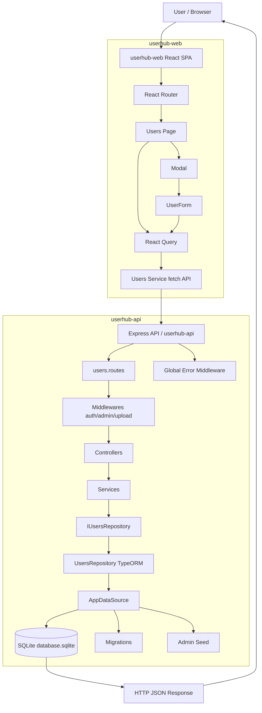

<h1 align="center"> Architecture</h1>

<p align="center">
System architecture reference for the UserHub monorepo, covering frontend, backend, data access, and runtime flow.
</p>

<h2> Table of Contents </h2>

- [Overview](#overview)
- [Monorepo Structure](#monorepo-structure)
- [Backend Architecture](#backend-architecture)
  - [Layered Design](#layered-design)
  - [Backend Request Flow](#backend-request-flow)
- [Frontend Architecture](#frontend-architecture)
  - [Routing and Layout](#routing-and-layout)
  - [State and Data Fetching](#state-and-data-fetching)
- [Cross-Cutting Concerns](#cross-cutting-concerns)
- [Architecture Diagram](#architecture-diagram)
- [Return to Root README](#return-to-root-readme)

## Overview

UserHub is organized as a **fullstack monorepo** with two workspace applications:

- `userhub-api`: REST API built with Express, TypeScript, TypeORM, SQLite
- `userhub-web`: React SPA built with Vite, React Router, React Query

The architecture follows a modular style inspired by Clean Architecture, where business rules are concentrated in services and infrastructure concerns are separated into repositories, HTTP controllers, and shared framework modules.

## Monorepo Structure

```bash
userHub/
├── docs/
├── userhub-api/
│   ├── src/
│   │   ├── modules/users/
│   │   │   ├── controllers/
│   │   │   ├── services/
│   │   │   ├── repositories/
│   │   │   ├── entities/
│   │   │   └── dtos/
│   │   ├── routes/
│   │   ├── shared/
│   │   │   ├── container/
│   │   │   ├── database/
│   │   │   ├── errors/
│   │   │   └── middlewares/
│   │   └── config/
│   └── tmp/avatar/
└── userhub-web/
    └── src/
        ├── pages/
        ├── components/
        ├── services/
        ├── routes/
        └── layout/
```

## Backend Architecture

### Layered Design

The backend user module is split into clear responsibilities:

- **Routes**: map HTTP endpoints to controllers and middlewares.
- **Controllers**: translate request/response and call application services.
- **Services**: contain business logic and validation.
- **Repositories**: abstract persistence operations.
- **Entities/DTOs**: define data models and transfer contracts.
- **Shared layer**: dependency injection container, middlewares, errors, and database bootstrapping.

Main technologies:

- Express for HTTP server
- TypeORM for ORM + migrations
- tsyringe for dependency injection
- jsonwebtoken and bcryptjs for auth/security primitives
- multer for file upload (avatars)

### Backend Request Flow

1. Client sends request to an endpoint under `/users`.
2. Route applies middlewares (`ensureAuthenticated`, `ensureAdmin`, upload middleware when needed).
3. Controller extracts params/body and resolves a service from `tsyringe` container.
4. Service executes business rules and delegates persistence to repository interface.
5. Repository implementation uses TypeORM datasource/entity to read/write SQLite.
6. Controller returns HTTP response.
7. Global error middleware formats domain/system errors.

## Frontend Architecture

### Routing and Layout

The web app uses React Router with a shared app shell:

- `AppRoutes` defines `/`, `/dashboard`, `/users`, `/settings`
- `AppLayout` wraps pages with `Sidebar` + `Topbar`
- Route metadata (`handle.title`) is consumed to render dynamic topbar titles

### State and Data Fetching

The app uses React Query for server state:

- `useQuery` for fetching users list
- `useMutation` for create/update/delete user operations
- Query invalidation refreshes table state after successful mutations

UI composition in users page:

- `Users` page manages modal state and selected user
- Generic `Modal` provides overlay/dialog shell
- `UserForm` handles create/edit validation and submit flows
- Service layer (`src/services/Users.ts`) centralizes HTTP calls to API

## Cross-Cutting Concerns

- **Dependency Injection**: service/repository wiring in `shared/container`.
- **Error Handling**: centralized `AppError` + global express error middleware.
- **Database Bootstrap**: datasource initialization, migrations execution, and admin seed creation at startup.
- **Observability**: request logging middleware prints method, route, and status code.

## Architecture Diagram



## Return to Root README

- [Back to `userHub/README.md`](../README.md)
